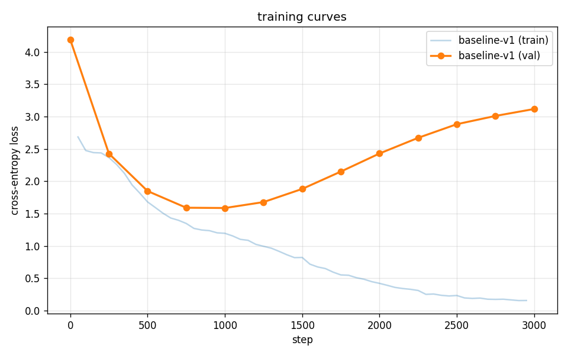

# mini-deepseek-v4

A small-scale, locally-trainable PyTorch implementation of just the **Compressed
Sparse Attention (CSA)** mechanism from the DeepSeek-V4 paper
(*Towards Highly Efficient Million-Token Context Intelligence*, 2026), §2.3.1,
eqs. (9)–(19).

The goal is **architectural understanding and validation**, not a frontier model.
A tiny vanilla-attention baseline and a CSA variant are trained on the same
small dataset and their loss curves compared. See [`notes.md`](notes.md) for the
full dimension table and the six approved design decisions (D1–D6).

## Project status

Built incrementally; each stage is committed in a runnable state.

- [x] **Stage 1** — vanilla decoder-only transformer baseline.
- [ ] Stage 2 — CSA compression only (eqs. 9–12), no indexer.
- [ ] Stage 3 — Lightning indexer (eqs. 13–17).
- [ ] Stage 4 — Shared-KV MQA (eqs. 18–19).

## Stage 1 results — vanilla baseline

Config: `d_model=384`, 6 layers, 6 heads (`head_dim=64`), `block_size=1024`,
`batch_size=32`, AdamW lr 3e-4 → 3e-5 cosine, 100-step warmup, 3000 iters.
Char-level vocab (65), tied LM head, ~12M params.

| metric                       | value     |
| ---------------------------- | --------- |
| init loss                    | 4.18 ≈ ln(65) ✓ |
| **min val loss**             | **1.585 (ppl 4.88) at step 1000** |
| final train loss             | 0.151 (ppl 1.16) — clearly memorizing |
| train/val gap at step 3000   | 2.97 nats — large, expected |
| throughput                   | ~217K tok/s on RTX 5070 Ti |
| wall time                    | 528 s |



The val curve bottoms around step 1000 and climbs as the over-capacity model
memorizes. This is fine as a reference: the **comparison vs. CSA** will look
at min val loss, the step at which it's reached, and the shape before overfit.
A generation sanity check produces plausible Shakespeare-flavored dialogue
with correct character formatting, confirming end-to-end correctness.

## Setup

Requires Python 3.12 and a CUDA GPU (tested on RTX 5070 Ti, sm_120, CUDA 12.8).

```bash
uv venv --python 3.12
uv pip install --index-url https://download.pytorch.org/whl/cu128 torch
uv pip install -r requirements.txt
```

(`torch` is installed from the CUDA-12.8 wheel index because Blackwell-class GPUs
need it; CPU-only or older-CUDA setups can use the default index.)

## Run

```bash
# vanilla baseline
.venv/bin/python train.py --run-name baseline-v1 --max-iters 3000

# CSA (Stage 2+)
.venv/bin/python train.py --run-name csa-v1 --attention csa --max-iters 3000

# plot
.venv/bin/python plot.py baseline-v1                # single run
.venv/bin/python plot.py baseline-v1 csa-v1         # comparison
```

Logs land in `runs/<run-name>/log.jsonl` (jsonl, one entry per train/eval event),
checkpoints in `runs/<run-name>/final.pt` (gitignored — too large), and plots in
`results/`.

## Configuration knobs

`train.py --help` lists everything. The key knobs:

| Flag             | Default | What                                              |
| ---------------- | ------- | ------------------------------------------------- |
| `--attention`    | vanilla | `vanilla` or `csa`                                |
| `--d-model`      | 384     | hidden size                                       |
| `--n-layers`     | 6       | transformer blocks                                |
| `--n-heads`      | 6       | attention heads                                   |
| `--block-size`   | 1024    | training sequence length                          |
| `--batch-size`   | 32      |                                                   |
| `--max-iters`    | 3000    |                                                   |
| `--lr`           | 3e-4    | peak learning rate (cosine schedule, warmup 100)  |

## Design

Architecture choices for v1, all justified in [`notes.md`](notes.md):

- **No RoPE** — learned absolute position embeddings, identical for baseline
  and CSA, so the comparison isolates the attention mechanism.
- **RMSNorm pre-norm**, **SwiGLU MLP** — standard modern decoder ingredients.
- **Char-level tokenizer** on TinyShakespeare (vocab=65). Simpler than BPE for
  a learning project.
- **Tied LM head** weights with token embeddings.
- **AdamW**, betas (0.9, 0.95), weight decay 0.1 on 2D params only, grad clip 1.0,
  cosine LR schedule with linear warmup.

### Known limitations (v1)

- The first `m` positions of every sequence are **masked from the loss** in the
  CSA variant (no causally-valid compressed block exists). The model is
  technically untrained on those positions; eval excludes them. See D2 in
  `notes.md`.
- **Train/eval mismatch**: indexer is dense at train, top-k at eval (D3). Eval
  reports *both* numbers. Don't claim "CSA matches baseline" using only the
  dense number.
- **No length extrapolation** — fixed `block_size`, no RoPE.

### Out of scope (do not add)

Per the project plan: MoE, FP4/FP8, Muon optimizer, mHC residuals, HCA,
sliding-window attention, attention sink, multi-GPU, gradient checkpointing,
FlashAttention. Each is its own project.

## Repo layout

```
model.py            # transformer + (later) CSA attention block
train.py            # training loop, --attention {vanilla,csa}
data.py             # TinyShakespeare char-level loader
plot.py             # loss-curve plotting
tests/              # unit tests for CSA math (Stage 2+)
notes.md            # dimension table + design decisions D1-D6
runs/<name>/        # per-run logs, configs, checkpoints
results/            # plots
```
