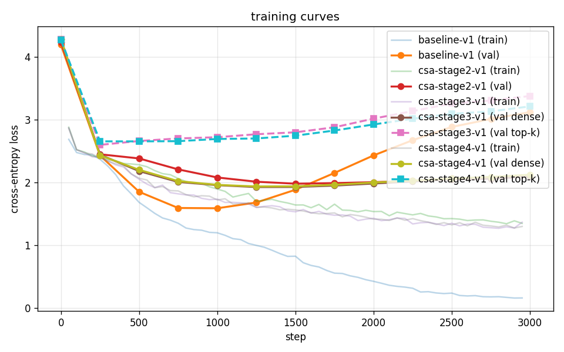

# mini-deepseek-v4

A small-scale, locally-trainable PyTorch implementation of just the **Compressed
Sparse Attention (CSA)** mechanism from the DeepSeek-V4 paper
(*Towards Highly Efficient Million-Token Context Intelligence*, 2026), §2.3.1,
eqs. (9)–(19).

The goal is **architectural understanding and validation**, not a frontier model.
A tiny vanilla-attention baseline and a CSA variant are trained on the same
small dataset and their loss curves compared. See [`notes.md`](notes.md) for the
full dimension table and the six approved design decisions (D1–D6).

## Project status

Built incrementally; each stage is committed in a runnable state.

- [x] **Stage 1** — vanilla decoder-only transformer baseline.
- [x] **Stage 2** — CSA compression (eqs. 9–12) with dense attention over all C^Comp blocks.
- [x] **Stage 3** — Lightning indexer (eqs. 13–17) with dense-train / top-k-eval (D3).
- [x] **Stage 4** — Shared-KV MQA (eqs. 18–19): core queries reuse the indexer's latent c^Q.

The four-stage CSA implementation is now complete. Future-work items (auxiliary
KL teacher loss, partial RoPE, sliding window, attention sink, grouped output
projection, HCA) are tracked in `notes.md`.

## Results

All runs share the same architecture skeleton: `d_model=384`, 6 layers, 6 heads
(`head_dim=64`), `block_size=1024`, `batch_size=32`, AdamW lr 3e-4 → 3e-5
cosine schedule, 100-step warmup, 3000 iters, char-level TinyShakespeare,
tied LM head. The only thing that varies is the attention block.

CSA shared config: `m=4`, `c=64` (= head_dim) so the KV cache is compressed
4× along the sequence dimension (`n_blk=256` for `block_size=1024`).

| metric                          | baseline-v1     | csa-stage2-v1   | csa-stage3-v1   | csa-stage4-v1   |
| ------------------------------- | --------------- | --------------- | --------------- | --------------- |
| attention                       | full MHA        | dense compressed | + indexer       | + shared latent |
| init loss                       | 4.18 (= ln 65)  | 4.18            | 4.25            | 4.26            |
| **best val loss dense (step)**  | **1.585 (1000)** | **1.977 (1500)** | **1.923 (1250)** | **1.933 (1250)** |
| best val loss top-k (step)      | —               | —               | 2.718 (1000)    | **2.690 (1000)** |
| final val loss dense @ 3000     | 3.116           | 2.101           | 2.090           | 2.119           |
| final val loss top-k @ 3000     | —               | —               | 3.375           | **3.209**       |
| final train loss @ 3000         | 0.151           | 1.378           | 1.279           | 1.286           |
| train/val gap dense @ 3000      | 2.965           | 0.723           | 0.811           | 0.833           |
| params (excl embeddings)        | ~10.7M          | ~10.5M          | ~10.7M          | **~9.9M**       |
| throughput                      | 217K tok/s      | 192K tok/s\*    | 159K tok/s\*    | 156K tok/s\*    |
| wall time                       | 528 s           | 589 s           | 810 s           | 819 s           |



\* Throughput is *worse* than baseline despite CSA having ~4× fewer attention
FLOPs because Stages 2-3 use an explicit `masked_fill + softmax + nan_to_num`
path rather than `F.scaled_dot_product_attention`. Vectorizing the safe-softmax
against SDPA is a Stage 4 cleanup item; in v1 we prioritize clarity over perf.

### Reading the curves

- **Baseline** overfits hard: train → 0.15 (memorization), val bottoms at
  step 1000 and *climbs* to 3.12 by step 3000.
- **Stage 2 CSA** (dense): compression acts as a strong regularizer.
  Train bottoms at 1.38, val nearly flat at ~2.10. Best val 0.4 nats worse
  than baseline — that's the cost of 4× compression on char-level.
- **Stage 3 CSA dense eval** (indexer-as-additive-logits): the indexer
  contributes meaningful gradient and dense val loss improves slightly
  over Stage 2 (1.92 vs 1.98). The Stage 2 vs Stage 3 dense curves are
  very close — the indexer doesn't dramatically help when full attention
  is available.
- **Stage 3 CSA top-k eval** at `k=16/256` blocks (pink dashed): much worse
  (2.72 → 3.38). The dense vs top-k gap *grows* with training: as the model
  sharpens its dense attention pattern, the indexer's additive-bias signal
  isn't a good top-k selector. **This is exactly the train/eval mismatch
  flagged in D3** of `notes.md` and is the price of skipping the auxiliary
  KL loss the paper uses to align indexer with attention.
- **Stage 4 CSA** (shared latent c^Q): structural cleanup matching the
  paper's eqs. 18–19 verbatim. Dense val is statistical-noise close to
  Stage 3, top-k val is ~0.16 nats *better* (3.21 vs 3.38 final). The
  shared latent means `W_DQ` now gets gradient from BOTH the indexer
  *and* the core attention, which plausibly nudges the indexer's score
  distribution closer to actual attention usage. Param count drops from
  ~10.7M to ~9.9M because `W_UQ : d_c × n_h·c` is half the size of the
  Stage-3 `W_Q : d × n_h·c` it replaces.

### The dense / top-k gap is real

In v1 the indexer is trained as an additive logit on the core attention
score; top-k is applied only at eval. Without the paper's auxiliary KL loss,
nothing pushes the indexer's score *distribution* to match the actual
attention usage — so picking the indexer's top-k blocks discards blocks
the dense attention was using. With `k=16/256` (6.25%) we lose ~0.8 nats.
This is honest evidence for why the paper-faithful approach (aux KL teacher)
matters and is on the future-work list.

### Eval comparability note

CSA eval excludes the first `m=4` positions per sequence from the loss (D2
— those positions have no causally-valid compressed block). Baseline
includes all 1024 positions in eval. The 4-of-1024 = 0.4% gap is documented
but not corrected: it's well below the differences we care about.

## Setup

Requires Python 3.12 and a CUDA GPU (tested on RTX 5070 Ti, sm_120, CUDA 12.8).

```bash
uv venv --python 3.12
uv pip install --index-url https://download.pytorch.org/whl/cu128 torch
uv pip install -r requirements.txt
```

(`torch` is installed from the CUDA-12.8 wheel index because Blackwell-class GPUs
need it; CPU-only or older-CUDA setups can use the default index.)

## Run

```bash
# vanilla baseline
.venv/bin/python train.py --run-name baseline-v1 --max-iters 3000

# CSA (Stage 2+)
.venv/bin/python train.py --run-name csa-v1 --attention csa --max-iters 3000

# plot
.venv/bin/python plot.py baseline-v1                # single run
.venv/bin/python plot.py baseline-v1 csa-v1         # comparison
```

Logs land in `runs/<run-name>/log.jsonl` (jsonl, one entry per train/eval event),
checkpoints in `runs/<run-name>/final.pt` (gitignored — too large), and plots in
`results/`.

## Configuration knobs

`train.py --help` lists everything. The key knobs:

| Flag             | Default | What                                              |
| ---------------- | ------- | ------------------------------------------------- |
| `--attention`    | vanilla | `vanilla` or `csa`                                |
| `--d-model`      | 384     | hidden size                                       |
| `--n-layers`     | 6       | transformer blocks                                |
| `--n-heads`      | 6       | attention heads                                   |
| `--block-size`   | 1024    | training sequence length                          |
| `--batch-size`   | 32      |                                                   |
| `--max-iters`    | 3000    |                                                   |
| `--lr`           | 3e-4    | peak learning rate (cosine schedule, warmup 100)  |

## Design

Architecture choices for v1, all justified in [`notes.md`](notes.md):

- **No RoPE** — learned absolute position embeddings, identical for baseline
  and CSA, so the comparison isolates the attention mechanism.
- **RMSNorm pre-norm**, **SwiGLU MLP** — standard modern decoder ingredients.
- **Char-level tokenizer** on TinyShakespeare (vocab=65). Simpler than BPE for
  a learning project.
- **Tied LM head** weights with token embeddings.
- **AdamW**, betas (0.9, 0.95), weight decay 0.1 on 2D params only, grad clip 1.0,
  cosine LR schedule with linear warmup.

### Known limitations (v1)

- The first `m` positions of every sequence are **masked from the loss** in the
  CSA variant (no causally-valid compressed block exists). The model is
  technically untrained on those positions; eval excludes them. See D2 in
  `notes.md`.
- **Train/eval mismatch**: indexer is dense at train, top-k at eval (D3). Eval
  reports *both* numbers. Don't claim "CSA matches baseline" using only the
  dense number.
- **No length extrapolation** — fixed `block_size`, no RoPE.

### Out of scope (do not add)

Per the project plan: MoE, FP4/FP8, Muon optimizer, mHC residuals, HCA,
sliding-window attention, attention sink, multi-GPU, gradient checkpointing,
FlashAttention. Each is its own project.

## Repo layout

```
model.py            # transformer + (later) CSA attention block
train.py            # training loop, --attention {vanilla,csa}
data.py             # TinyShakespeare char-level loader
plot.py             # loss-curve plotting
tests/              # unit tests for CSA math (Stage 2+)
notes.md            # dimension table + design decisions D1-D6
runs/<name>/        # per-run logs, configs, checkpoints
results/            # plots
```
